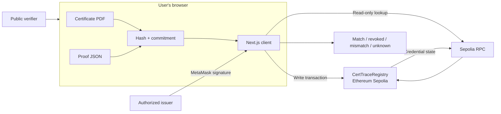

<div align="center">

<h1>CertTrace</h1>

<h3>Verifiable academic credentials without exposing student data on-chain</h3>

<p>CertTrace is a multi-issuer academic certificate integrity platform built for <strong>Smart India Hackathon 2026</strong>. It lets institutions register tamper-evident certificate commitments on Ethereum Sepolia and lets anyone verify a PDF in the browser—without uploading the document, revealing student data, connecting a wallet, or paying gas.</p>

<p>
  <a href="https://www.sih.gov.in/sih2026PS"></a>
  <a href="https://www.sih.gov.in/sih2026PS"></a>
  <a href="https://sepolia.etherscan.io/address/0xd754993064d4bb81ff456b0EA6791CFa63569E7b"></a>
  <a href="#validation-status"></a>
</p>

<p>
  <strong><a href="https://certtrace-sih2026.vercel.app">Open the live application</a></strong>
  · <strong><a href="https://sepolia.etherscan.io/address/0xd754993064d4bb81ff456b0EA6791CFa63569E7b">View the registry</a></strong>
  · <strong><a href="#quick-start">Quick start</a></strong>
  · <strong><a href="#architecture">Architecture</a></strong>
</p>

<p>Developed by <strong>SolveArc BWU</strong></p>

</div>

---

## The problem

Academic certificates are routinely shared as PDF files, but a PDF alone cannot show whether it is the exact document issued by an institution, whether it has since been altered, or whether the credential remains valid. Manual verification is slow, institution-specific, and difficult to scale. Publishing certificates or student details on a public blockchain would create a separate and unacceptable privacy problem.

## The solution

CertTrace creates a privacy-conscious verification layer between issuing institutions and certificate verifiers:

1. An authorized institution selects a certificate PDF in the browser.
2. CertTrace hashes the exact file locally and creates a salted cryptographic commitment.
3. Only the commitment, issuer address, timestamps, and credential status are registered on Sepolia.
4. The student receives the original PDF and a small proof JSON file.
5. A verifier recomputes the commitment locally and checks the trusted registry through a read-only RPC connection.

The PDF, student name, grades, email address, and salt are **never uploaded by the application or stored on-chain**.

> A successful verification proves that the supplied PDF exactly matches the document committed by an authorized issuer and that the credential has not been revoked. It does not independently prove institutional accreditation or the truth of every statement inside the document.

## Why CertTrace stands out

| Design decision | Benefit |
| --- | --- |
| Exact-byte PDF verification | Any change to the document—even a subtle one—produces a different commitment. |
| Browser-side cryptography | Sensitive certificate contents remain on the user's device. |
| Multi-issuer registry | Multiple institutions can issue independently under explicit on-chain authorization. |
| Wallet-free public verification | Employers and other verifiers do not need MetaMask or test ETH. |
| Issuer-controlled revocation | Only the original issuer can revoke its credential, even after its future issuance permission is removed. |
| Registry-bound proof files | A proof cannot silently redirect verification to an attacker-controlled contract. |
| Minimal QR payload | The QR carries only a public verification URL and credential ID—not the PDF, salt, proof, or personal data. |

## SIH 2026 alignment

| Field | Project alignment |
| --- | --- |
| Problem statement | **SIH26194** |
| Organization | AICTE |
| Department | AICTE, MIC-Student Innovation |
| Category | Software |
| Theme | Blockchain & Cybersecurity |
| Official brief | “Student Innovation—Provide ideas in a decentralized and distributed ledger technology … that can radically change multiple sectors.” |
| CertTrace application | Uses a decentralized registry to make academic credential integrity and revocation independently verifiable while keeping personal documents off-chain. |

The official statement is available in the [SIH 2026 problem-statement directory](https://www.sih.gov.in/sih2026PS).

## Product walkthrough

### Issue

1. Connect an authorized issuer wallet through MetaMask on Sepolia.
2. Select a PDF. CertTrace validates its basic metadata and header, hashes its exact bytes, and generates a random credential ID and salt.
3. Download the proof JSON and confirm that it has been retained.
4. Sign `issueCredential(credentialId, commitment)` in MetaMask.
5. CertTrace waits for the receipt and validates the stored state before reporting success.
6. Download a QR entry point for the public verification page.

### Verify

1. Open the public verifier directly or through the certificate's QR code.
2. Select the received PDF and proof JSON.
3. CertTrace reconstructs the commitment locally.
4. A read-only Sepolia provider retrieves the credential record.
5. The application reports one explicit outcome:

| Result | Meaning |
| --- | --- |
| `MATCHES_REGISTERED_DOCUMENT` | The document matches an existing, active credential. |
| `REVOKED_REGISTERED_DOCUMENT` | The document matches, but its original issuer revoked it. |
| `DOCUMENT_MISMATCH` | The credential exists, but the PDF/proof pair does not match its commitment. |
| `UNKNOWN_CREDENTIAL` | No record exists for the supplied credential ID. |
| `VERIFICATION_UNAVAILABLE` | Invalid input, configuration, hashing, or RPC access prevented a reliable result. |

### Revoke and manage issuers

- The registry administrator can authorize or remove issuer wallets.
- Authorization controls future issuance; it does not erase earlier credentials.
- Only a credential's original issuer can revoke it.
- Revocation is permanent and preserves the original issuance record.
- Removing an issuer does not prevent that issuer from revoking credentials it previously issued.

## Architecture



Next.js serves the application, while cryptography and file handling run in the browser. MetaMask is used only for issuer, revocation, and administrator transactions. Public verification uses ethers.js with a read-only JSON-RPC provider. There is no application API, user database, login service, or hosted certificate store.

## Cryptographic design

For every issuance, CertTrace computes:

```text
fileHash  = SHA-256(exact PDF bytes)
commitment = keccak256(
  solidityPacked("CERTTRACE_V1", credentialId, fileHash, salt)
)
```

- `credentialId` and `salt` are independently generated 32-byte random values using `crypto.getRandomValues()`.
- `CERTTRACE_V1` is a stable cryptographic domain separator; it is not a legacy-contract selector.
- The salt prevents someone who only sees an on-chain commitment from confirming guesses about a document.
- The credential ID provides a non-personal public lookup key.

The proof file uses this schema:

```typescript
interface VerificationProof {
  version: 1;
  credentialId: string;
  salt: string;
  chainId: number;
  contractAddress: string;
}
```

The verifier accepts only Sepolia (`11155111`) and the configured trusted registry. The proof is not a standalone authenticity claim; it supplies the values needed to reconstruct and check the on-chain commitment.

## Data and trust boundaries

| Data | Stored where |
| --- | --- |
| PDF bytes, student identity, grades | Remain in the original local document |
| Salt and verification metadata | Local proof JSON held by the certificate recipient |
| Credential ID | Proof JSON, QR URL, and on-chain mapping key |
| Commitment, issuer, issuance time | On-chain registry state |
| Revocation flag and time | On-chain registry state |
| Administrator and issuer permissions | On-chain registry state |

## Technology stack

| Layer | Technologies |
| --- | --- |
| Frontend | Next.js 16.3.6, React 19.2.8, TypeScript 5.9.3 |
| Styling | Tailwind CSS 4.3.3 |
| Web3 and cryptography | ethers.js 6.17.0, Browser Web Crypto API, MetaMask/EIP-1193 |
| QR generation | QRCode 1.5.4 |
| Smart contract | Solidity 0.8.34 on Ethereum Sepolia |
| Contract tooling | Hardhat 3.17.0, Hardhat Ignition 3.1.8, TypeScript 6.0.3 |
| Quality checks | Node test runner, Mocha/Chai, forge-std, ESLint, TypeScript |
| Hosting | Vercel |

No AI/ML model, IPFS integration, backend API, or application database is required by the current implementation.

## Quick start

### Prerequisites

- Git
- Node.js 24.x and npm
- A browser with Web Crypto support
- MetaMask and Sepolia test ETH for write operations only

### 1. Clone and install

```bash
git clone https://github.com/SayanModakDev/certtrace-sih2026.git
cd certtrace-sih2026
npm ci --prefix web
npm ci --prefix blockchain
```

The root package provides command wrappers. The `web/` and `blockchain/` packages maintain separate lockfiles, so no root installation is required.

### 2. Configure the web application

On macOS or Linux:

```bash
cp web/.env.example web/.env.local
```

On Windows PowerShell:

```powershell
Copy-Item web/.env.example web/.env.local
```

| Variable | Purpose |
| --- | --- |
| `NEXT_PUBLIC_CONTRACT_ADDRESS` | Trusted registry used for issuance and verification |
| `NEXT_PUBLIC_APP_ORIGIN` | Public origin embedded in verification QR links |
| `NEXT_PUBLIC_SEPOLIA_RPC_URL` | Read-only Sepolia endpoint used for public verification |

The tracked [example configuration](web/.env.example) points to the recorded registry and public application. To generate QR links for local development, set:

```dotenv
NEXT_PUBLIC_APP_ORIGIN=http://localhost:3000
```

These values are public frontend configuration. Never place private keys, seed phrases, or other secrets in a `NEXT_PUBLIC_*` variable.

### 3. Run

```bash
npm run dev
```

Open [http://localhost:3000](http://localhost:3000). For a local production build:

```bash
npm run build
npm start
```

## Testing

From the repository root:

```bash
npm run test:web
npm run lint
npm run build
npm run test:blockchain
```

For the blockchain TypeScript check:

```bash
cd blockchain
npx tsc --noEmit
```

The automated suites cover authorization, independent issuers, duplicate prevention, revocation permissions, state read-back, deterministic hashing, proof validation, contract binding, QR safety, modified-document detection, RPC failures, and verification outcomes. Wallet/provider interactions are mocked in frontend tests; they complement rather than replace live-wallet acceptance testing.

### Validation status

Validated locally on **26 September 2026** against commit [`e12d21f`](https://github.com/SayanModakDev/certtrace-sih2026/commit/e12d21fa260fafe51f7fa5da4d3117beb30ed185), using Node.js `24.18.0` and npm `11.13.0`:

| Check | Result |
| --- | --- |
| Frontend tests | **33 passed, 0 failed** |
| Frontend ESLint | **Passed** |
| Production build and TypeScript | **Passed** |
| Blockchain TypeScript | **Passed** |
| Solidity compilation | **Passed** with solc 0.8.34 |
| Blockchain tests | **44 passed, 0 failed**: 8 Solidity + 36 Mocha |
| Public application availability | **HTTP 200**; bundle references the current registry |
| Sepolia deployment lookup | Contract bytecode present; recorded transaction resolves to block `11778118` |
| Complete live multi-wallet acceptance | **Pending** |

## Deployment

### Public deployment

| Item | Value |
| --- | --- |
| Application | [certtrace-sih2026.vercel.app](https://certtrace-sih2026.vercel.app) |
| Network | Ethereum Sepolia (`11155111`) |
| Current registry | [`0xd754993064d4bb81ff456b0EA6791CFa63569E7b`](https://sepolia.etherscan.io/address/0xd754993064d4bb81ff456b0EA6791CFa63569E7b) |
| Deployment transaction | [`0xa66350459240e883604bff8bfad46e84b5b34a7641f085b0c4d5edfb80436e15`](https://sepolia.etherscan.io/tx/0xa66350459240e883604bff8bfad46e84b5b34a7641f085b0c4d5edfb80436e15) |
| Deployment block | `11778118` |
| Registry admin / initial issuer | `0x89CA83fB6Ed701549D6D40c404445fB4F06FB542` |

The public application is configured for this registry. Source validation and read-only deployment checks pass; a complete live acceptance run with the administrator and a second issuer remains pending.

Historical V1 (`0x0F89d0a4311a3EEbB6C04F664A590DB73006Ceca`) and V2 (`0xF8bd01c81124c0a9008463b40dD0a1aFf7D9256a`) sources and tests remain in the repository for traceability. The current frontend does not route to those contracts, and their proof files are not accepted by the current registry configuration.

### Live acceptance checklist

Use fictional certificate data and retain the resulting evidence:

- [ ] Authorize a second issuer wallet.
- [ ] Issue independent credentials from the administrator and second issuer.
- [ ] Verify the original PDF/proof pair through the public application.
- [ ] Confirm that a modified PDF returns `DOCUMENT_MISMATCH`.
- [ ] Confirm that a different issuer cannot revoke the credential.
- [ ] Remove the original issuer's issuance permission.
- [ ] Confirm that the original issuer can still revoke its earlier credential.
- [ ] Confirm that the revoked document returns `REVOKED_REGISTERED_DOCUMENT`.

## Current limitations

- **Exact-byte matching:** Re-saving or re-exporting a visually identical PDF may change its bytes and therefore its hash.
- **Proof custody:** Losing the proof JSON prevents commitment reconstruction; there is currently no recovery service.
- **File validation:** CertTrace checks filename, MIME metadata, size, and the `%PDF-` header, but does not fully parse the PDF structure.
- **Wallet recovery:** The registry has no administrator-transfer or recovery mechanism.
- **Permanent revocation:** A revoked credential cannot be restored.
- **RPC dependence:** Public verification requires the configured Sepolia endpoint to be reachable.
- **Scale:** The application does not yet provide batch issuance, credential discovery, analytics, or automated document delivery.
- **Prototype network:** Sepolia is appropriate for demonstration and acceptance testing, not production credential issuance.

## Repository map

```text
certtrace-sih2026/
├── web/
│   ├── app/                     # Routes, layout, and global styles
│   ├── components/              # Issuer/admin and verifier interfaces
│   ├── lib/                     # Crypto, proof, QR, config, and contract logic
│   └── test/                    # Frontend and mocked integration tests
├── blockchain/
│   ├── contracts/               # Current registry and historical contracts
│   ├── ignition/modules/        # Hardhat deployment modules
│   ├── scripts/                 # Network and historical workflow utilities
│   └── test/                    # Smart-contract tests
├── package.json                 # Root command wrappers
└── README.md                    # Project overview and operating guide
```

Component-specific documentation is available in the [web application guide](web/README.md) and [blockchain guide](blockchain/README.md).

## Roadmap

- Complete and document the live multi-issuer acceptance run.
- Add a reproducible demo fixture with fictional certificate data.
- Add end-to-end browser tests with a local development chain.
- Introduce administrator transfer or multisignature governance.
- Evaluate institution-level identity and accreditation metadata without placing personal data on-chain.
- Add batch issuance and privacy-preserving proof recovery options.
- Conduct an independent smart-contract security review before any production-network deployment.

## Security and responsible use

Never commit `.env.local`, private keys, recovery phrases, keystores, passwords, real student documents, generated secrets, or local Ignition deployment state. Use only fictional records for demonstrations and tests. Report security issues privately to the repository owner rather than opening a public exploit report.

## Team

CertTrace is developed by **SolveArc BWU** for Smart India Hackathon 2026.

## License

No repository-wide license has been published yet. Individual Solidity files include SPDX identifiers; those headers do not automatically license the rest of the repository.
